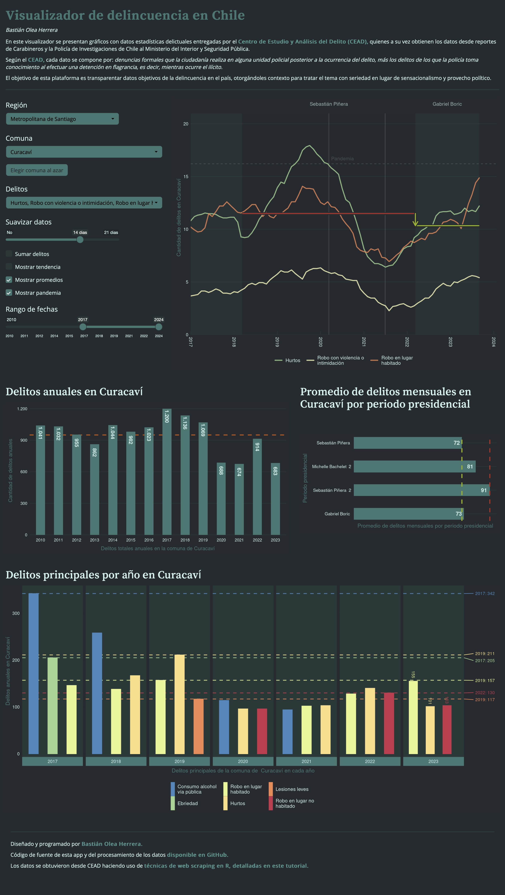
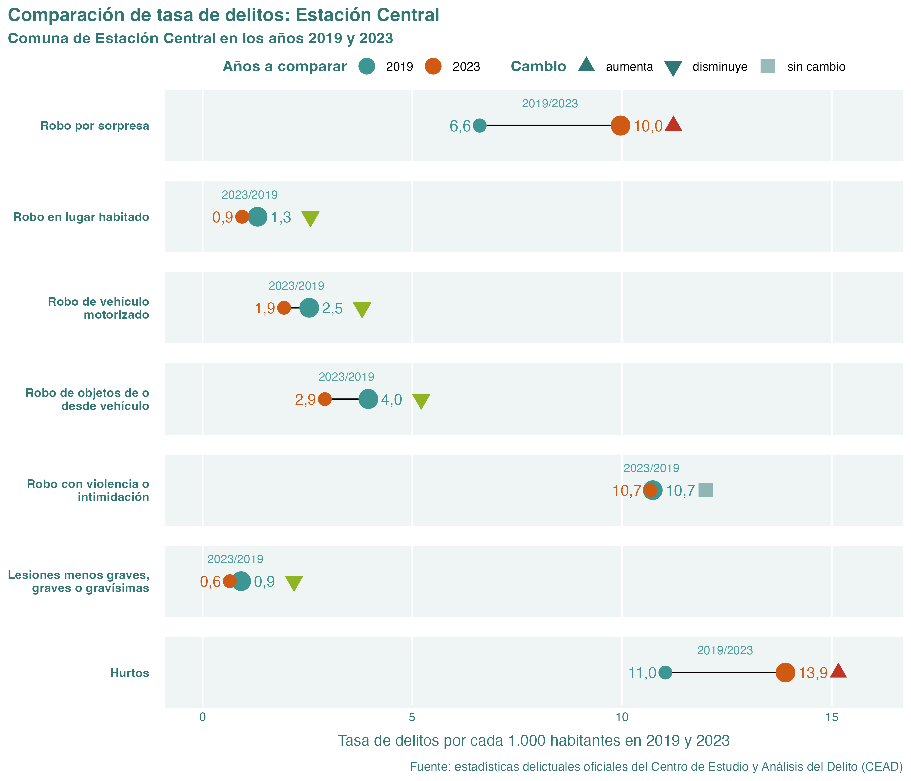
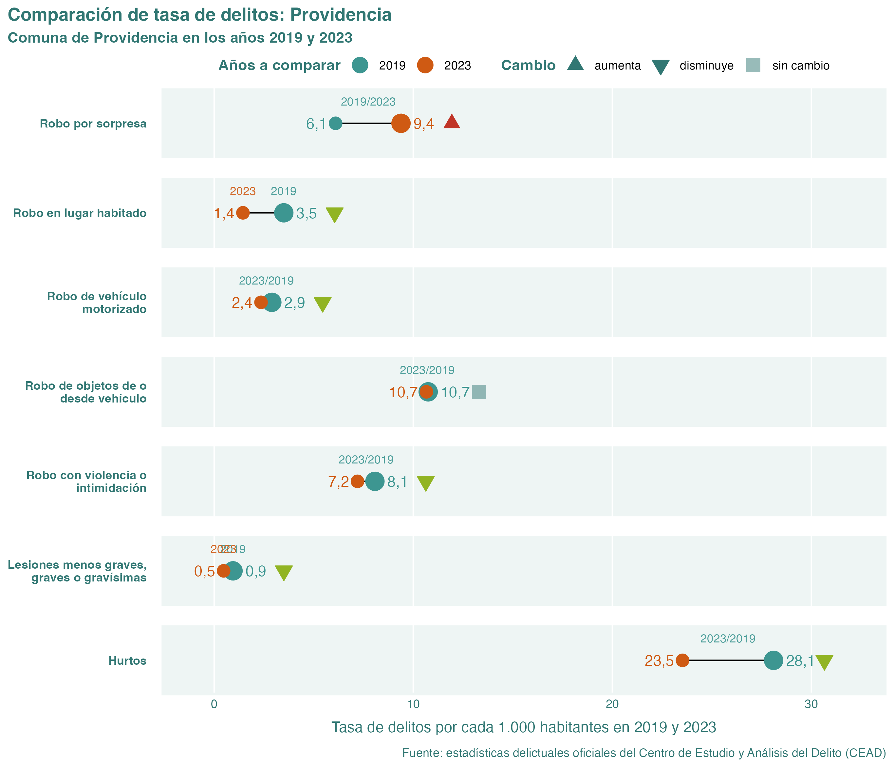
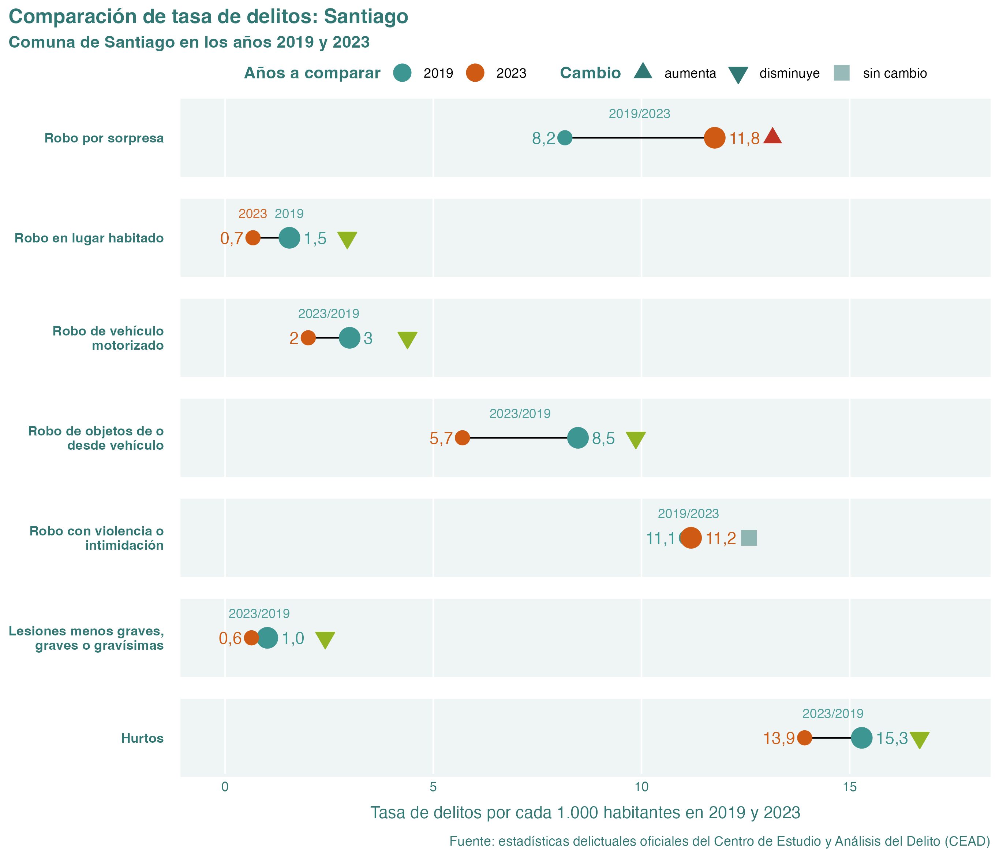
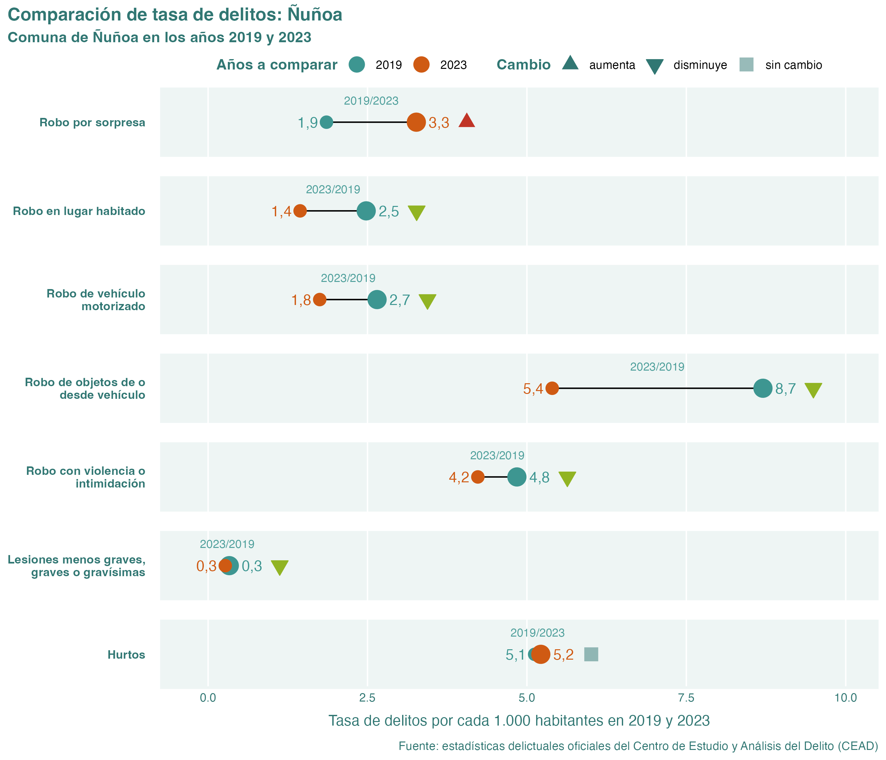

# Visualizador de estadísticas oficiales de delincuencia en Chile

_Bastián Olea Herrera_

## Aplicación

En este [visualizador web](https://bastianoleah.shinyapps.io/delincuencia_chile) se presentan gráficos con datos estadísticas delictuales entregadas por el [Centro de Estudio y Análisis del Delito (CEAD),](https://cead.spd.gov.cl/estadisticas-delictuales/) quienes a su vez obtienen los datos desde reportes de Carabineros y la Policía de Investigaciones de Chile al Ministerio del Interior y Seguridad Pública.

Según el [CEAD,](https://cead.spd.gov.cl/estadisticas-delictuales/) cada dato de delito se compone por: _denuncias formales que la ciudadanía realiza en alguna unidad policial posterior a la ocurrencia del delito, más los delitos de los que la policía toma conocimiento al efectuar una detención en flagrancia, es decir, mientras ocurre el ilícito._

El objetivo de esta plataforma es transparentar datos objetivos de la delincuencia en el país, otorgándoles contexto para tratar el tema con seriedad en lugar de sensacionalismo y provecho político.

[La aplicación web está disponible en shinyapps.io](https://bastianoleah.shinyapps.io/delincuencia_chile), o bien, puedes clonar este repositorio en tu equipo para usarla por medio de RStudio.

## Datos

Los datos se obtuvieron directamente desde CEAD haciendo uso de [técnicas de web scraping en R, detalladas en este tutorial.](https://bastianolea.github.io/tutorial_r_datos_delincuencia/). En este repositorio, el script `obtener_datos_delincuencia.R` realiza el scraping del sitio web de CEAD para los años y comunas que se le indique, y guarda los datos crudos (las tablas en formato html). Luego, el script `procesar_datos_delincuencia.R` carga estos datos crudos y los transforma a tablas, las limpia, y guarda los datos en formato `parquet` para lectura rápida. No se puede guardar en formato Excel porque tiene más de un millón de filas.

Los datos limpios están disponibles en la carpeta `datos_procesados`.

### Descargar datos

La base de datos de delitos denunciados en Chile del Centro de Estudio y Análisis del Delito (CEAD), obtenida, ordenada y limpiada mediante el código de este repositorio, se encuentra disponible en formato `.parquet` [en este enlace.](https://github.com/bastianolea/delincuencia_chile/blob/main/datos_procesados/cead_delincuencia_chile.parquet)

**Nota:** los datos ya no están disponibles en formato `.csv`, porque la cantidad de observaciones aumentó y el archivo resultante pesaba más de 100 megas. En comparación, el formato `.parquet`, que es más eficiente y rápido, pesa sólo 1.1MB.

## Actualizaciones

**Actualización 17/12/2024:**
- Datos actualizados hasta septiembre de 2024 (máximo disponible en CEAD a la fecha)
- Optimización de aplicación para que use tipografías locales en vez de cargarlas desde Google Fonts
- Se vuelve a usar el paquete `arrow` para cargar los datos, porque es más rápido que `nanoparquet`.
- Correcciones mínimas.

**Actualización 03/07/2024:**

- Datos actualizados hasta marzo de 2024 (máximo disponible en CEAD a la fecha)
- Actualización del código de scraping para que funcione con la actualización del sitio de CEAD
- Los datos ahora representan _casos policiales_ en vez de solo _denuncias._ Los casos policiales "consideran las denuncias de delitos que realiza la comunidad en las unidades policiales, más las detenciones que realizan las policías ante la ocurrencia de delitos flagrantes".
- Se cambia el paquete que carga los datos a `nanoparquet`, que tiene menos dependencias que `arrow`
- Se flexibiliza el código de la app para que se adapte a las fechas que vienen en los datos, para facilitar actualizaciones futuras

## Gráficos
### Comparación de delitos reportados entre 2019 y 2023

#### Delitos en Estación Central, comparación 2019 y 2023

#### Delitos en La Florida, comparación 2019 y 2023

#### Delitos en Providencia, comparación 2019 y 2023

#### Delitos en Puente Alto, comparación 2019 y 2023

#### Delitos en Santiago, comparación 2019 y 2023

#### Delitos en Ñuñoa, comparación 2019 y 2023

----

Diseñado y programado en R por Bastián Olea Herrera. Magíster en Sociología, data scientist.

https://bastianolea.rbind.io

Puedes explorar mis otras [aplicaciones interactivas sobre datos sociales en mi portafolio.](https://bastianolea.github.io/shiny_apps/)

Contacto: https://bastianolea.rbind.io/contact
