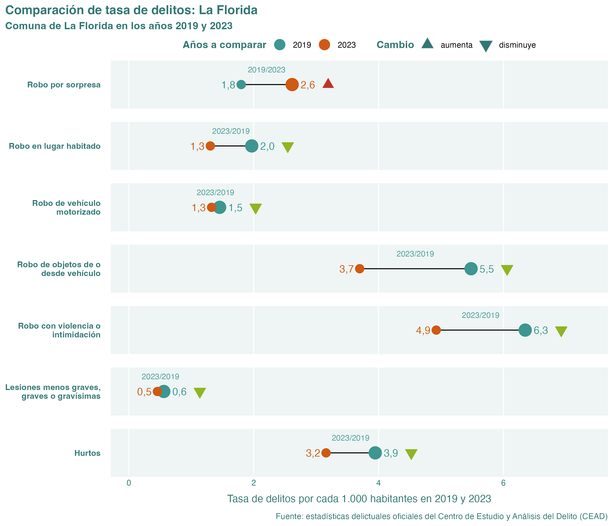
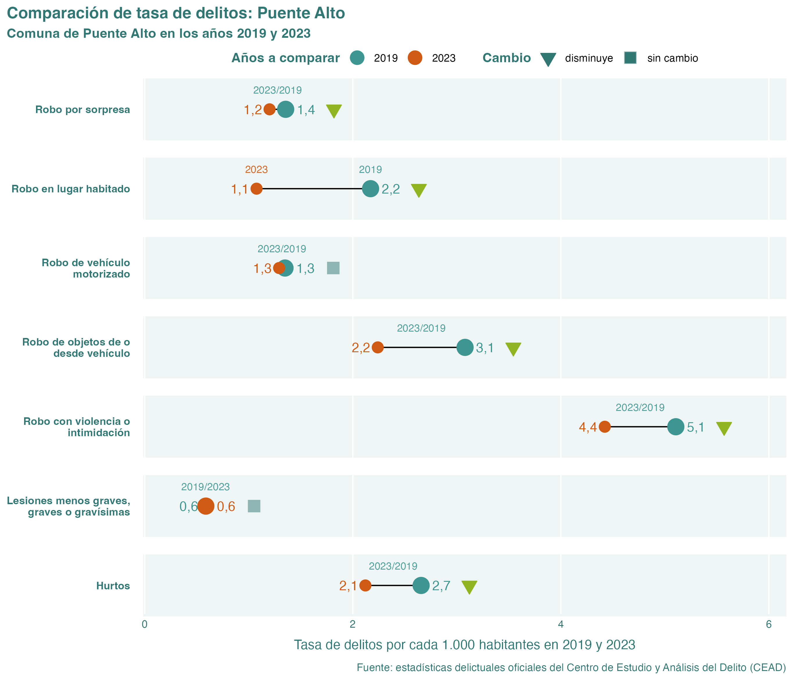

# Visualizador de estadísticas oficiales de delincuencia en Chile

_Bastián Olea Herrera_

En este [visualizador web](https://bastianoleah.shinyapps.io/delincuencia_chile) se presentan gráficos con datos estadísticas delictuales entregadas por el [Centro de Estudio y Análisis del Delito (CEAD),](https://cead.spd.gov.cl/estadisticas-delictuales/) quienes a su vez obtienen los datos desde reportes de Carabineros y la Policía de Investigaciones de Chile al Ministerio del Interior y Seguridad Pública.

Según el [CEAD,](https://cead.spd.gov.cl/estadisticas-delictuales/) cada dato se compone por: _denuncias formales que la ciudadanía realiza en alguna unidad policial posterior a la ocurrencia del delito, más los delitos de los que la policía toma conocimiento al efectuar una detención en flagrancia, es decir, mientras ocurre el ilícito._

El objetivo de esta plataforma es transparentar datos objetivos de la delincuencia en el país, otorgándoles contexto para tratar el tema con seriedad en lugar de sensacionalismo y provecho político.

[La aplicación web está disponible en shinyapps.io](https://bastianoleah.shinyapps.io/delincuencia_chile), o bien, puedes clonar este repositorio en tu equipo para usarla por medio de RStudio.

Los datos se obtuvieron directamente desde CEAD haciendo uso de [técnicas de web scraping en R, detalladas en este tutorial.](https://bastianolea.github.io/tutorial_r_datos_delincuencia/)

## Comparación de delitos reportados entre 2019 y 2023

### Delitos en Estación Central, comparación 2019 y 2023

### Delitos en La Florida, comparación 2019 y 2023

### Delitos en Providencia, comparación 2019 y 2023

### Delitos en Puente Alto, comparación 2019 y 2023

### Delitos en Santiago, comparación 2019 y 2023

### Delitos en Ñuñoa, comparación 2019 y 2023

----

Diseñado y programado en R por Bastián Olea Herrera. Magíster en Sociología, data scientist.

https://bastian.olea.biz

bastianolea arroba gmail punto com
